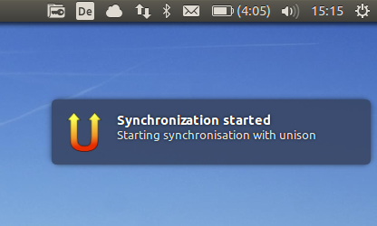
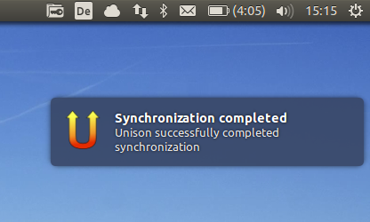

=================
Unisonotify
=================

A small wrapper script for unison that uses libnotify
to indicate when unison started and how it completed.

The script can be called via cron or anacron to automate data synchronisation.

Preview
=========

   Preview 1 (Ubuntu)

   Preview 2 (Ubuntu)

Installation
=============

The only requirement for the main script is 
unison (should be on the system PATH) and the
python-notify package.

On ubuntu or debian run::

  apt-get install python-notify unison

Create unison profiles for the folders you want to
synchronize and optionally add scripts to ``/etc/cron.hourly`` to automatically
run the synchronisation with anacron::

	#!/bin/sh
	# run unison sync as user foo for profile bar
	sudo -u foo -H /home/foo/.local/bin/Unisonotify/unisonotify.py bar

License
========
Copyright © 2013 Rocco Schulz

This work is free. You can redistribute it and/or modify it under the
terms of the Do What The Fuck You Want To Public License, Version 2,
as published by Sam Hocevar. See the LICENSE file for more details.
